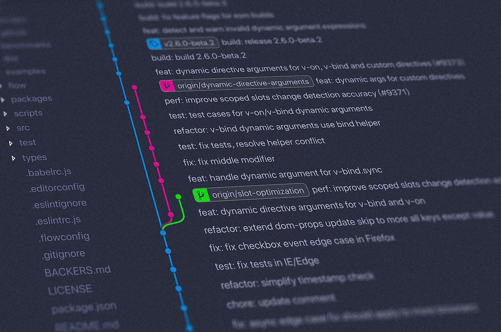
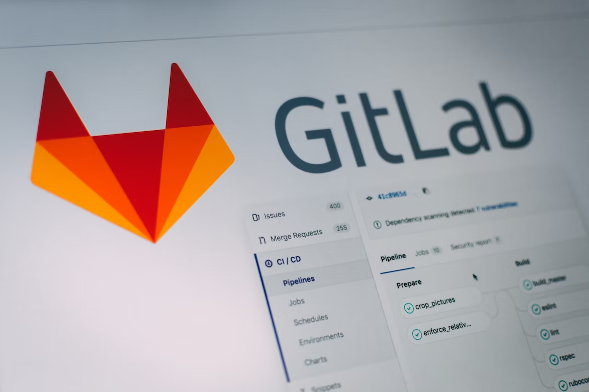

Git is a distributed version control system that has become the de facto standard for software development teams worldwide. It is an open-source tool that provides a way to track changes to software source code over time, collaborate with other developers, and manage the development process of complex projects.

## When it was created?

Git was created by Linus Torvalds in 2005 and is used by many large organizations, including Google, Microsoft, and Facebook, as well as by individual developers. The tool is designed to make it easy to work with a team of developers and keep track of changes to a codebase. It is also built to be scalable, so that it can handle large projects with many contributors.

Git is a decentralized version control system, which means that each developer has a local copy of the entire repository, including all historical versions of the code. This makes it easy for developers to work independently, without having to be connected to a central server. It also makes it easy to merge changes made by different developers, since each copy of the repository includes all of the history of the project.

One of the key benefits of using Git is that it provides a complete history of changes made to a codebase. This makes it easy to revert to an earlier version of the code if a problem is found, or to see how a particular feature was implemented. In addition, Git provides a powerful set of tools for comparing different versions of code and for tracking the development process.

Git also makes it easy to collaborate with other developers. It provides a way to manage different branches of a project, which allows multiple developers to work on different features at the same time. When changes are made to a branch, they can be merged into the main branch, ensuring that everyone is working with the latest version of the code.

Another important feature of Git is that it makes it easy to manage and track issues with a project. Issues can be logged and assigned to individual developers, and their status can be tracked over time. This makes it easy to see what has been done and what still needs to be done.

### Conclusion
In conclusion, Git is a powerful and flexible tool that is essential for software development teams. Its decentralized design, complete history of changes, and ability to manage different branches and track issues make it the perfect tool for managing the development process of complex projects. Whether you are working on a small side project or a large-scale software development effort, Git can help you keep your code organized and under control.