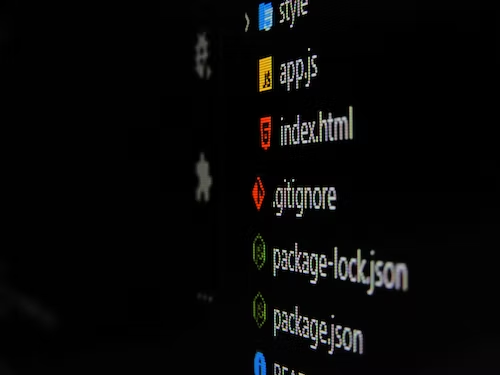

## Get it started

Git is a powerful version control system widely used by software developers to track changes made to their code. With every change, developers make a commit, which records a snapshot of the code at that particular point in time. Commits play a crucial role in the development process, so it's important to ensure that they are well-structured and follow best practices. This article will discuss some of the best practices for making effective Git commits.

## Best rules to follow

1. Write clear and descriptive commit messages: Commit messages are the main way to communicate what changes have been made in a particular commit. As such, it's important to write clear and descriptive messages that explain the purpose of the changes. This makes it easier for others to understand the changes and collaborate effectively on the codebase. A good commit message should be brief (less than 72 characters) and should provide a clear explanation of the changes made in that commit.

2. Keep commits small and focused: A common mistake developers make is to make large commits that contain a lot of changes. This makes it difficult to track the changes and understand the purpose of the commit. It's best to keep commits small and focused, making sure that each commit records a single change or a small set of related changes. This makes it easier to revert changes if needed and helps to keep the codebase clean and well-organized.

3. Use branches effectively: Branches are a powerful feature of Git that allow developers to work on separate parts of the codebase simultaneously. It's best to use branches for specific features or bug fixes and make sure that each branch contains a specific set of changes. This helps to keep the codebase organized and makes it easier to track changes. When the work on a branch is complete, it can be merged into the main branch, ensuring that the code is always up-to-date.

4. Avoid using the "force push" option: The "force push" option allows developers to overwrite the history of a Git repository, which can be dangerous and cause problems. Instead of using the "force push" option, it's best to use other Git commands like "rebase" or "cherry-pick" to integrate changes into the codebase. This helps to maintain the integrity of the code and makes it easier to track changes.

5. Test changes before committing: Before committing changes, it's important to test the code to make sure that it works as expected. This helps to ensure that the code is of high quality and reduces the chances of introducing bugs or breaking the code. Testing also helps to catch any potential problems early, making it easier to fix them.

Git also makes it easy to collaborate with other developers. It provides a way to manage different branches of a project, which allows multiple developers to work on different features at the same time. When changes are made to a branch, they can be merged into the main branch, ensuring that everyone is working with the latest version of the code.

### Conclusion
In conclusion, following best practices for Git commits can greatly improve the development process and make it easier for teams to collaborate effectively. Writing clear and descriptive commit messages, keeping commits small and focused, using branches effectively, avoiding the "force push" option, and testing changes before committing are all important aspects of making effective Git commits. By following these best practices, developers can ensure that their code is well-organized, easy to understand, and of high quality.